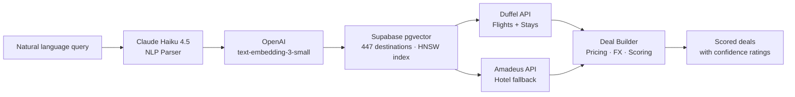

# Roami

**NLP-powered city break search engine.** Type what you want in plain English — Roami figures out where you're going, finds real flights, scores every deal, and gets smarter the more you search.

Roami exists because flight search is still built around filters. Sliders for price, dropdowns for dates, airport codes you need to already know. The bet here is that natural language is a better interface for travel discovery — "somewhere warm, good food, under £400" should just work. This is the working product that tests that thesis.

Live at [roami.world](https://roami.world).

---

## How It Works



The search pipeline is a single POST to `/api/search`. Claude Haiku extracts structured intent from the query (destinations, dates, budget, traveller count, interests). That intent is embedded and matched against 447 pre-embedded destinations via cosine similarity. Matched destinations feed parallel Duffel API calls for flights and stays, with Amadeus Hotel Search as a fallback when Duffel Stays returns empty. The deal builder assembles results, converts currencies, applies the pricing model, scores each deal across five factors, and strips internal margin data before returning to the client.

---

## Key Technical Features

### Semantic Destination Search

**447 destinations pre-embedded with OpenAI `text-embedding-3-small`, stored in Supabase with an HNSW vector index.** Each destination embedding encodes geographic, cultural, and experiential context — not just the city name. A query for "somewhere warm and cheap" matches semantically against those embeddings via cosine similarity. Keyword matching is the fallback when OpenAI is unavailable; semantic search is the default.

### NLP Query Understanding

**Claude Haiku 4.5 parses natural language into a structured `ParsedIntent` object** — destinations, origin airport, budget per person, departure window, nights, traveller count, and inferred interests. The prompt is designed with explicit injection defence (user input is quoted and role-separated). Parsing latency is low enough to run synchronously in the search path.

### 5-Factor Deal Confidence Scoring

**Each deal receives a 0–100 confidence score** built from five weighted factors:

| Factor | What it measures |
|--------|-----------------|
| **Price percentile** | Where this price sits relative to tracked market data for the route |
| **Semantic similarity** | How closely the destination matched the original query embedding |
| **Booking lead time** | Days until departure — short lead time penalised |
| **Price trend** | Whether route prices are rising, falling, or stable (Upstash Redis) |
| **Session alignment** | How well the deal matches the user's inferred preference profile |

Scores are accompanied by a human-readable `confidenceRationale` string explaining the headline factor.

### Dynamic Pricing Engine

**Real-time cost modelling with the full Duffel fee structure baked in.** The pricing engine calculates:

- Duffel flight fee: £2.40 flat + 1% of ticket value per confirmed order
- Roami markup: 5% on total order value
- Payment processing: 1.4% (EU card via Duffel Payments)
- ATOL levy: £2.50/passenger on flight+hotel packages
- Ancillary filtering: categories with sub-£20 average price are suppressed (the £1.60 flat ancillary fee makes low-value ancillaries loss-making)

Each deal carries a `netMargin` and `isLossMaker` flag internally. These are stripped before the client response.

### Live FX Rates

**Exchange rates from open.er-api.com, cached for 24 hours** with hardcoded fallback rates so FX conversion never blocks a search. All internal pricing is normalised to GBP. The deal builder converts Duffel's multi-currency responses on the way in.

### Session Personalisation

**Hybrid session model: server-side profile in Supabase, client-side signals in `sessionStorage`.** Each search incrementally updates a `SessionProfile` with inferred interests, destination history, budget signals, and travel style indicators. On subsequent searches, the session profile is loaded and fed into confidence scoring — deals that align with established preferences score higher. The `roami_sid` cookie links requests to server-side profiles without exposing session data to client JavaScript.

### Market Price Intelligence

**Route-level price observations are logged to Upstash Redis** after each search. Rolling statistics (median, percentile buckets, trend direction) build up over time and feed the price percentile factor in confidence scoring. Without Redis configured, price percentile scoring is omitted — all other factors still apply.

---

## Strategy-First Approach

This project started with structured discovery before any code was written. Fourteen strategy documents were produced using a structured validation framework, covering:

- **Business Model Canvas** (current and target state)
- **Blue Ocean Analysis** — mapping competitive whitespace across 12 UK travel platforms
- **Value Proposition Canvas** — jobs, pains, gains mapped against existing alternatives
- **Porter's Five Forces** — industry attractiveness score: 2.5/5, with identified whitespace
- **Wardley Mapping** — component evolution and build/buy decisions
- **Playing to Win** / Strategy Kernel / WWHTBT conditions
- **Revenue model research** — Duffel breakeven analysis, bed bank net rate economics, ATOL packaging margins

The original strategy called for gated landing page validation before building. That approach was abandoned when the landing page couldn't generate meaningful signal. The pivot: build the thinnest possible working slice — NLP search, real flights, deal scoring — and validate through real usage by friends rather than proxy metrics.

The three identified strategic cruxes (booking leakage, cold start paradox, affiliate cash flow trap) remain the active risks. The current phase tests whether users will actually search and return — the earliest evidence point for or against the booking leakage risk.

Full strategy corpus: [`docs/strategy/`](docs/strategy/)

---

## Built With

| Technology | Role |
|-----------|------|
| Next.js 16 (App Router) + React 19 | Frontend and API routes |
| TypeScript | Type safety throughout |
| Supabase (pgvector, RLS) | Vector search and session storage |
| Duffel API (`@duffel/api`) | Live flights and stays |
| Amadeus (`amadeus`) | Hotel search fallback when Duffel Stays is empty |
| Claude Haiku 4.5 (`@anthropic-ai/sdk`) | NLP query parsing |
| OpenAI `text-embedding-3-small` | Destination embeddings |
| Upstash Redis (`@upstash/redis`) | Market price intelligence cache |
| Tailwind CSS v4 | Styling (CSS-first config) |
| Vitest | Unit testing |
| Vercel | Hosting and serverless functions |

---

## Getting Started

**Prerequisites:** Node.js 18+

```bash
# Clone and install
git clone https://github.com/clairedonald/roami.git
cd roami
npm install

# Configure environment
cp .env.example .env.local
# Edit .env.local — see comments in .env.example for each variable

# Run development server
npm run dev
# → http://localhost:3000
```

**Required env vars:** `ANTHROPIC_API_KEY`, `DUFFEL_API_TOKEN`, `SUPABASE_URL`, `SUPABASE_SERVICE_ROLE_KEY`

**Optional:** `OPENAI_API_KEY` (search degrades to keyword matching without it), `UPSTASH_REDIS_REST_URL` + `UPSTASH_REDIS_REST_TOKEN` (market price intelligence disabled without them), `AMADEUS_API_KEY` + `AMADEUS_API_SECRET` (hotel search falls back to estimated data without them)

---

## Project Structure

```
roami/
├── src/
│   ├── app/
│   │   ├── api/
│   │   │   ├── search/            # POST /api/search — main search endpoint
│   │   │   ├── booking/confirm/   # POST /api/booking/confirm — order creation via Duffel
│   │   │   ├── track/             # POST /api/track — session event tracking
│   │   │   ├── waitlist/          # POST /api/waitlist — email capture
│   │   │   └── health/            # GET /api/health — liveness probe
│   │   ├── deal/[id]/             # Deal detail page (flight timeline, hotel, price breakdown)
│   │   └── page.tsx               # Landing page and search UI
│   ├── lib/
│   │   ├── nlp-parser.ts          # Claude Haiku intent extraction
│   │   ├── embeddings.ts          # OpenAI embedding generation
│   │   ├── destination-search.ts  # Supabase pgvector cosine similarity
│   │   ├── duffel-client.ts       # Duffel flight and stays API client
│   │   ├── amadeus-client.ts      # Amadeus hotel search (fallback when Duffel Stays empty)
│   │   ├── deal-builder.ts        # Deal assembly and 5-factor confidence scoring
│   │   ├── deal-store.ts          # In-memory deal cache for detail page lookups
│   │   ├── pricing.ts             # Duffel fee model, markup (tier-aware), and ATOL
│   │   ├── fx-rates.ts            # Live exchange rates with 24h cache
│   │   ├── price-intelligence.ts  # Upstash Redis price tracking
│   │   ├── session-store.ts       # Server-side session (Supabase)
│   │   ├── session-preferences.ts # Client-side preference + tracking (breakdown clicks, Pro interest)
│   │   └── __tests__/             # 114 unit tests across 8 files
│   ├── components/
│   │   ├── deal/                  # Deal detail (DealDetail, FlightTimeline, PriceSummary, AncillarySelector, ProTeaser)
│   │   ├── booking/               # Booking flow (BookingForm, PassengerForm, PaymentSection)
│   │   └── demo/                  # Search UI (NlpSearchDemo, DealCard, PreferencesPanel)
│   └── types/
│       └── index.ts               # Shared TypeScript types
├── docs/
│   ├── HANDOFF.md                 # Current status and next steps
│   ├── strategy/                  # 14 strategy framework documents
│   └── research/                  # Revenue model and Duffel economics research
└── supabase/
    └── migrations/                # Database schema (destinations and sessions tables)
```

---

## Testing

```bash
npm test            # run all tests (vitest)
npm run test:watch  # watch mode

npx tsc --noEmit    # typecheck
npm run build       # production build
```

**114 tests across 8 files** covering: deal builder, pricing engine, FX rates, price intelligence, Duffel client, Amadeus client, embedding generation, and destination search. Tests use `vi.mock` to isolate external API calls — no real API calls in the test suite.
