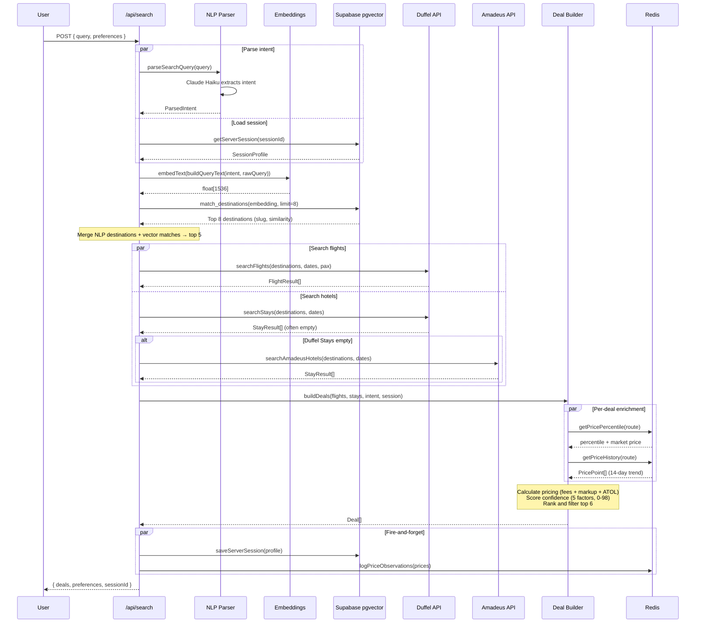

# Roami Architecture Review

**Date:** 2026-03-01
**Branch:** `feat/pricing-engine-personalisation`

---

## System Overview

Roami is an AI-powered travel deal finder. Users describe what they want in natural language ("somewhere warm under £400", "Greek island with direct flights"), and the system returns personalised, priced holiday packages combining flights and hotels.

The stack is **Next.js 14 (App Router)** on **Vercel**, with **Supabase** (PostgreSQL + pgvector), **Upstash Redis**, and four external APIs: Duffel (flights/hotels), Amadeus (hotel fallback), Anthropic Claude (NLP), and OpenAI (embeddings).

---

## Architecture Diagram

```mermaid
flowchart TB
    subgraph Client["Browser (Next.js Client)"]
        UI["Search UI<br/><small>Natural language input</small>"]
        DC["DealCard / DealDetail<br/><small>Results display</small>"]
        PS["PriceSummary<br/><small>Breakdown + sparkline</small>"]
        BK["Booking Page<br/><small>Contact CTAs</small>"]
        SS["Session Store<br/><small>sessionStorage + cookie</small>"]
    end

    subgraph API["Next.js API Routes (Vercel)"]
        SR["/api/search<br/><small>Main orchestrator</small>"]
        TR["/api/track<br/><small>Analytics events</small>"]
        BC["/api/booking/confirm<br/><small>Booking confirmation</small>"]
        WL["/api/waitlist<br/><small>Email capture</small>"]
        HL["/api/health<br/><small>Health check</small>"]
    end

    subgraph Pipeline["Search Pipeline (src/lib/)"]
        NLP["NLP Parser<br/><small>Claude Haiku</small>"]
        EMB["Embeddings<br/><small>OpenAI text-embedding-3-small</small>"]
        DS["Destination Search<br/><small>pgvector cosine similarity</small>"]
        FS["Flight Search<br/><small>Duffel SDK</small>"]
        HS["Hotel Search<br/><small>Duffel → Amadeus fallback</small>"]
        DB["Deal Builder<br/><small>Bundle + score + rank</small>"]
        PE["Pricing Engine<br/><small>Costs + markup + ATOL</small>"]
        PI["Price Intelligence<br/><small>Percentiles + trends</small>"]
        FX["FX Rates<br/><small>Currency → GBP</small>"]
        SP["Session Prefs<br/><small>Personalisation signals</small>"]
    end

    subgraph External["External Services"]
        ANTH["Anthropic<br/><small>Claude Haiku 4.5</small>"]
        OAI["OpenAI<br/><small>Embeddings API</small>"]
        DUF["Duffel<br/><small>Flights + Stays + Ancillaries</small>"]
        AMA["Amadeus<br/><small>Hotel Offers (fallback)</small>"]
    end

    subgraph Data["Data Stores"]
        SUPA["Supabase PostgreSQL<br/><small>Destinations (pgvector)<br/>Sessions · Deals · Prices</small>"]
        REDIS["Upstash Redis<br/><small>Rate limits<br/>Price observations (KV)<br/>FX cache</small>"]
    end

    %% Client → API
    UI -->|"POST /api/search"| SR
    DC -->|"POST /api/track"| TR
    BK -->|"POST /api/track"| TR
    BK -->|"POST /api/booking/confirm"| BC

    %% Search orchestration
    SR --> NLP
    SR --> EMB
    SR --> DS
    SR --> FS
    SR --> HS
    SR --> DB
    SR --> SP

    %% Pipeline → External
    NLP -->|"Intent parsing"| ANTH
    EMB -->|"Query vector"| OAI
    DS -->|"match_destinations RPC"| SUPA
    FS -->|"Offer search"| DUF
    HS -->|"Hotel offers"| DUF
    HS -.->|"Fallback"| AMA

    %% Deal building dependencies
    DB --> PE
    DB --> PI
    DB --> FX
    DB --> SP

    %% Data store connections
    PI -->|"Price observations"| REDIS
    PI -->|"Seed prices"| SUPA
    FX -->|"Rate cache"| REDIS
    SP -->|"Session read/write"| SUPA
    SR -->|"Rate limiting"| REDIS

    %% Response
    DB -->|"Deal[]"| SR
    SR -->|"JSON response"| DC

    %% Styling
    classDef external fill:#f0f4ff,stroke:#4a6fa5,color:#1a365d
    classDef data fill:#f0fdf4,stroke:#22c55e,color:#14532d
    classDef pipeline fill:#fefce8,stroke:#eab308,color:#713f12
    classDef api fill:#fdf2f8,stroke:#ec4899,color:#831843
    classDef client fill:#f8fafc,stroke:#64748b,color:#1e293b

    class ANTH,OAI,DUF,AMA external
    class SUPA,REDIS data
    class NLP,EMB,DS,FS,HS,DB,PE,PI,FX,SP pipeline
    class SR,TR,BC,WL,HL api
    class UI,DC,PS,BK,SS client
```



---

## Request Flow: Search Query → Deals



---

## Data Model

### Supabase Tables

| Table | Purpose | Key Columns |
|-------|---------|-------------|
| `destinations` | 447 destinations with embeddings | `slug`, `city`, `country`, `tags[]`, `embedding` (vector 1536) |
| `sessions` | User session profiles | `id`, `profile` (JSONB), `updated_at` |
| `deals` | Cached deal data | `id`, `deal_data` (JSONB), `created_at` |
| `seed_prices` | Baseline market prices | `route`, `nights`, `avg_price`, `min_price`, `max_price` |

### Redis Keys

| Pattern | Purpose | TTL |
|---------|---------|-----|
| `price:{route}:{nights}` | Price observations array (max 200) | 90 days |
| `fx:{from}:{to}` | Exchange rate cache | 24h |
| `ratelimit:{ip}` | Request counter | 1 min |

---

## Pricing Engine

Every deal goes through `calculateDealPricing()` which computes the full cost stack:

```
Flight cost (Duffel offer price in GBP)
+ Hotel cost (per person, nightly rate × nights ÷ travellers)
+ Duffel fee (£2.40 flat + 1% of flight)
+ Payment processing (1.4% of total charge)
+ ATOL protection (£2.50/person for flight+hotel packages)
+ Markup (5% of order total)
= Total customer price per person
```

Ancillaries (bags, flexible cancellation) are priced separately with a 12% margin floor.

---

## 5-Factor Confidence Scoring

Each deal receives a confidence score (0–98) used for ranking:

| Factor | Weight | What It Measures |
|--------|--------|-----------------|
| Price percentile | 0–25 pts | How cheap vs. observed market prices |
| Interest match | 0–20 pts | Destination tag overlap with user interests (pgvector similarity) |
| Lead time | 0–15 pts | Days until departure (sweet spot: 14–90 days) |
| Price trend | 0–15 pts | Falling/stable = good, rising = penalised |
| Session alignment | 0–15 pts | Repeat destinations, budget consistency, search count |
| Base | 10 pts | Floor score |

---

## Session & Personalisation

**Hybrid model:** Client-side `sessionStorage` for immediate state + server-side Supabase for persistence.

- **Cookie:** `roami_sid` (httpOnly, 30-day expiry)
- **Client signals tracked:** Search count, destinations viewed, budget range, interests, breakdown clicks, pro interest
- **Server profile (JSONB):** Aggregated search history, interest frequencies, budget signals
- **Impact:** Session alignment factor in confidence scoring; returning users get deals that match their emerging preferences

---

## Error Handling & Resilience

| Failure | Behaviour |
|---------|-----------|
| Duffel API timeout (8s) | Returns partial results from successful destinations |
| Duffel Stays empty/403 | Falls back to Amadeus hotel search |
| Amadeus API failure | Deals built with "Hotel TBC" estimated pricing |
| OpenAI embedding timeout (5s) | Falls back to NLP-only destinations |
| Redis unavailable | Price intelligence skipped, deals still built |
| Supabase session failure | Search works, personalisation degraded |
| Rate limit exceeded (5/min) | 429 response with retry-after header |

---

## Component Hierarchy

```
App Layout
├── Home Page (/)
│   ├── Header
│   ├── DemoSection
│   │   ├── SearchBox (NLP input)
│   │   └── DealCard[] (results grid)
│   │       ├── PriceSparkline (SVG trend chart)
│   │       └── ConfidenceBadge (removed)
│   ├── WaitlistForm
│   └── Footer
│
├── Deal Detail (/deal/[id])
│   ├── DealDetail (two-column layout)
│   │   ├── FlightTimeline (outbound/return segments)
│   │   ├── AncillarySelector (bags, flexibility)
│   │   └── PriceSummary (sticky sidebar)
│   │       ├── PriceSparkline
│   │       ├── Expandable breakdown
│   │       ├── ProTeaser
│   │       └── "Book This Deal" → /deal/[id]/book
│   │
│   └── Booking Page (/deal/[id]/book)
│       └── ContactSection
│           ├── Deal summary + price breakdown
│           ├── Email CTA (mailto: hello@roami.world)
│           └── WhatsApp CTA (wa.me/447730569793)
```

---

## Known Gaps & Recommendations

### Current Gaps

1. **No payment integration** — Booking is manual via email/WhatsApp. Stripe + Duffel payment intents planned for post-validation.
2. **Booking intent not persisted** — `booking_intent` events tracked via `/api/track` but not saved to the session profile in Supabase.
3. **Embedding cache not persistent** — OpenAI embedding results cached in-memory only; lost on cold start. Could be cached in Redis.
4. **"Hotel TBC" display** — When neither Duffel Stays nor Amadeus returns results, deals show estimated hotel pricing without clear UI indication.
5. **Price history sparse** — Sparklines only render when 2+ observations exist. New routes have no history until searched multiple times.

### Architecture Strengths

- **Clean separation of concerns** — Each lib module has a single responsibility
- **Graceful degradation** — Every external dependency has a fallback path
- **Personalisation without auth** — Session-based scoring works without requiring user accounts
- **Transparent pricing** — Full cost breakdown visible to users, no hidden fees
- **Semantic search** — pgvector enables "vibes-based" destination matching beyond keyword search
